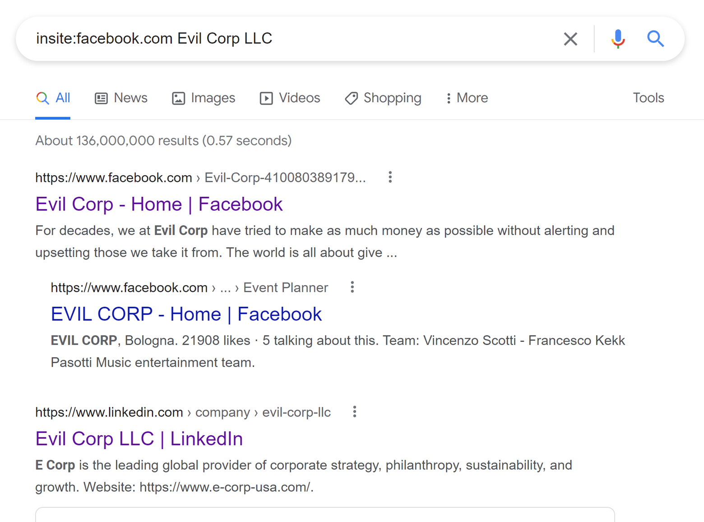
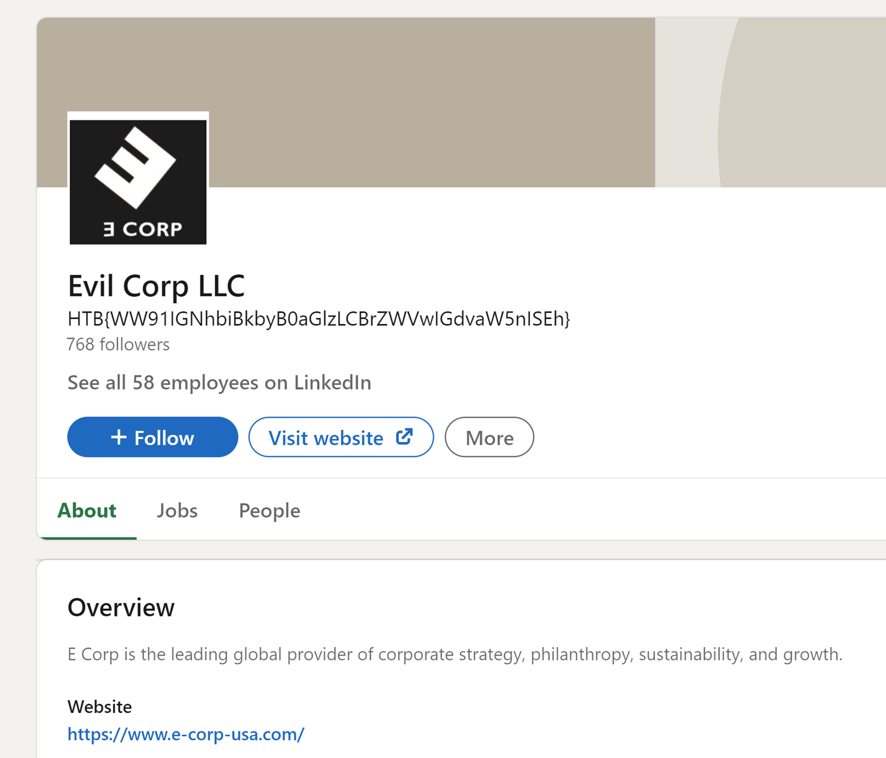
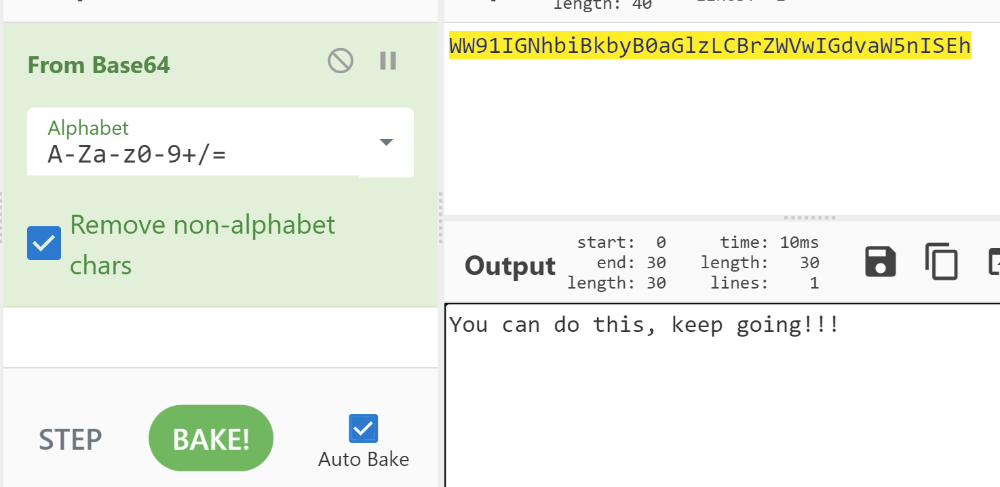
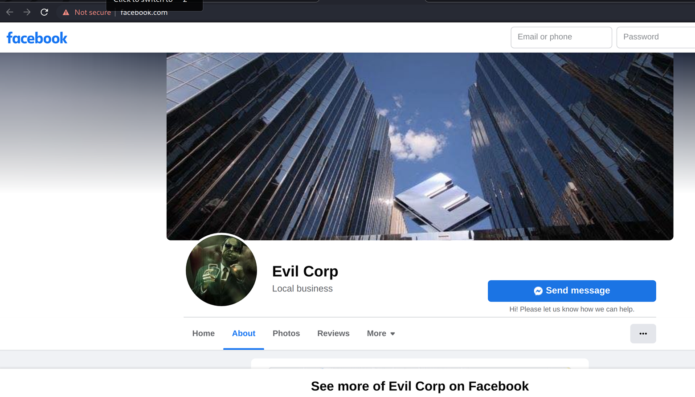
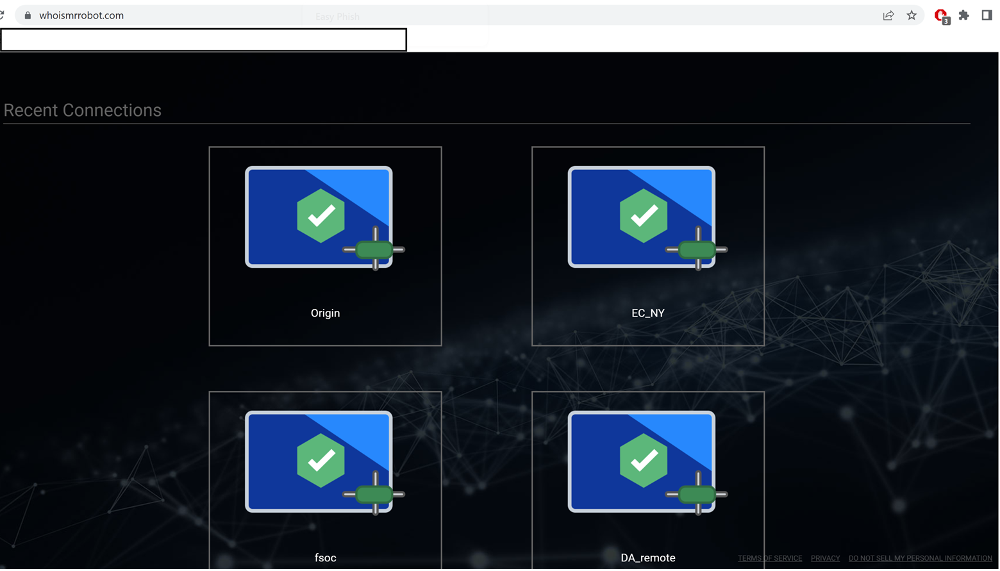
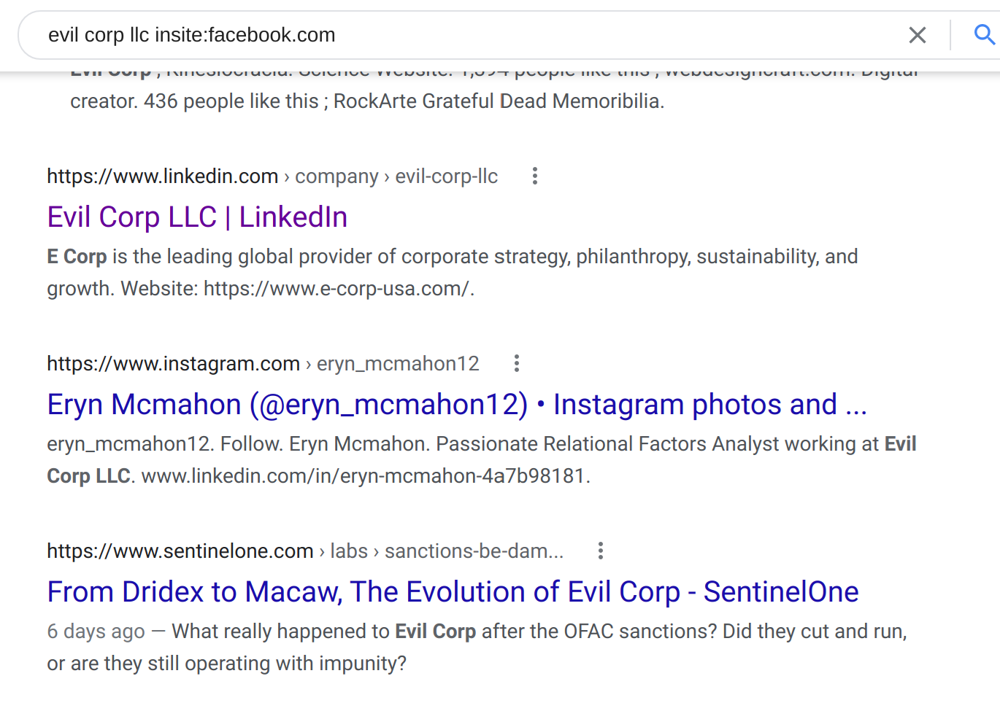
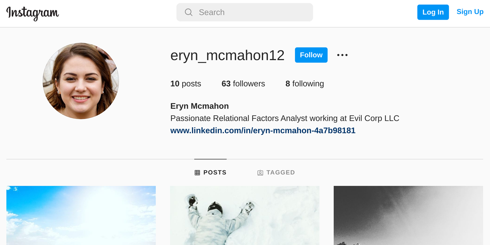
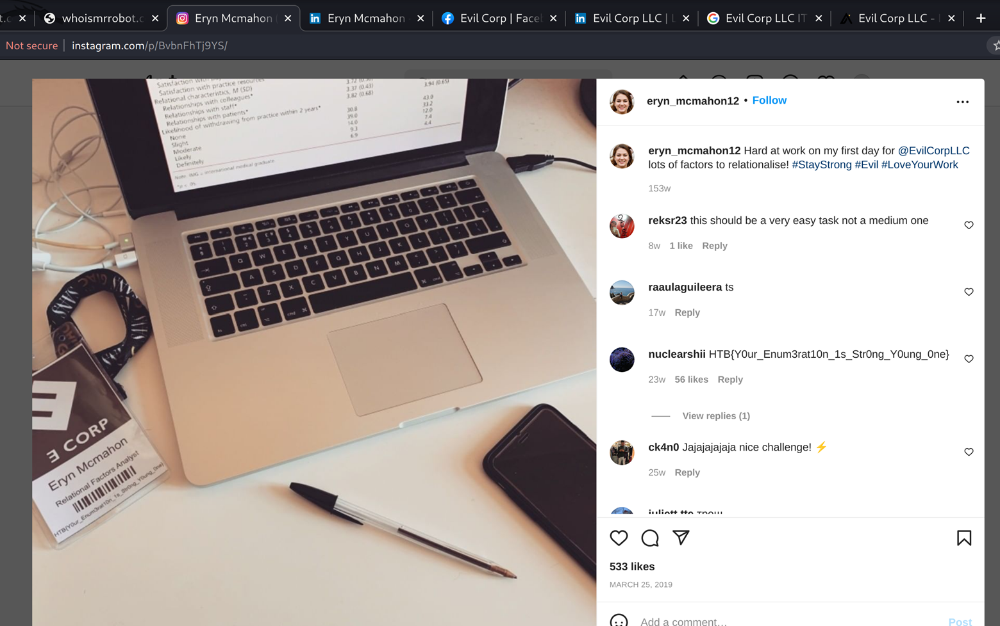

## Walkthrough
OSINT is an important and often overlooked part of pentesting. Doing proper reconnaissance can give you information you might need to impersonate or hack the target that requested pentesting services. Hack the Box has a number of OSINT challenges that can help you get started and today I’ll walk you through how I approached one of them.

### My Approach
<em>Infiltration</em> is, as of this writing, a medium level challenge. The prompt recommends doing recon on social media to find something that could help break into the target company: Evil Corp LLC.

My first instinct when doing recon is to use Google dorking to narrow down my search. Since the prompt told me to do some social media recon, I picked a social media site I thought might have information about Evil Corp LLC to start with – Facebook. Using the “insite” keyphrase, I searched for evidence of Evil Corp and got several results. At the top was a Facebook page followed by a LinkedIn page.

Although I was searching specifically for Facebook, the LinkedIn page made me curious and I decided to start there. I opened it up to find a flag right in the company description.

I was surprised, but other people had rated the challenge easy. From my experience with OSINT and encoding I could tell the flag was encoded in Base64 and that seemed odd. I tried it on the website just in case – it didn’t work – and then used Cyber Chef to decode the message.

A message of encouragement to show I was on the right track. Since this wasn’t the actual answer, I decided I probably needed to dig deeper on the LinkedIn site. I hadn’t forgotten about the Facebook result and didn’t want to leave it behind before diving deeper, so I took a look.

Unfortunately, there wasn’t anything really interesting or apparent related to the Hack the Box challenge. So, I went back to LinkedIn where I found a website listed for the company and decided to see if the flag was buried somewhere on the website. The website redirected to whoismrrobot[.]com which seemed to host different virtual machines with content related to the hacking group known as fsociety. I did some exploring on the machines’ terminals to look for documents or Hack the Box related information but nothing that looked like it would lead to a flag.

I took another look at the challenge prompt and decided to go back to social media to see if there were some other leads I missed. There wasn’t anything else on the Evil Corp LLC LinkedIn page, so I went back to my initial search results page and looked at the results under LinkedIn. The next link led to someone’s Instagram account and seemed more promising than the rest of the results.

The Google result didn’t initially seem like it would have an answer, but the account description said the user worked for Evil Corp LLC. There were no flags in the user’s description, just a link to LinkedIn and her job title.

I started clicking through the photos and landed on one with lots of comments, including an HTB flag. I noticed that the comment with the flag had been posted much more recently than the original post and I thought that was an odd way to set up a challenge, so I took a closer look at the original post. In the photo, the flag is printed on an ID badge. Once I realized the photo had an ID badge I connected that back to the original challenge prompt. It said, “find something to help you break into the company” and an ID badge fits that criteria more perfectly than I had expected.

I entered the ID badge flag on Hack the Box and the challenge was marked as successfully completed.

### Review and Advice
I thought this was a very interesting challenge that might have been more obvious at the start, but I spent a lot of time trying to figure out which leads to follow and how long to search before trying a new tactic. I think this challenge was appropriately rated as medium because it was possible to go down rabbit holes on the website and, even when you narrowed your search down to the Instagram page photo, the flag was pretty small.

While it took me longer to find the flag, I thought this challenge led to a good experience in testing out different OSINT tactics. I also thought that the way the location of the flag – on an ID badge – connected much better back to the prompt than I had anticipated. There were enough threads to trace to make it interesting and not too simple, but the answer, once you found it, made a lot of sense.

I would recommend that others completing OSINT challenges like this do a quick survey of the search engine results to determine where to drill down. I spent a lot of time on the Evil Corp website trying to dig up a flag there before remembering that the prompt focused on social media. I would also recommend looking for interesting elements to the challenges that could be useful when digging deeper on future challenges. Like the prompt’s phrasing “find something to help you break into the company” connecting to the ID badge where the flag was hidden or the fact that a comment containing the flag was posted way more recently than the post was created.
